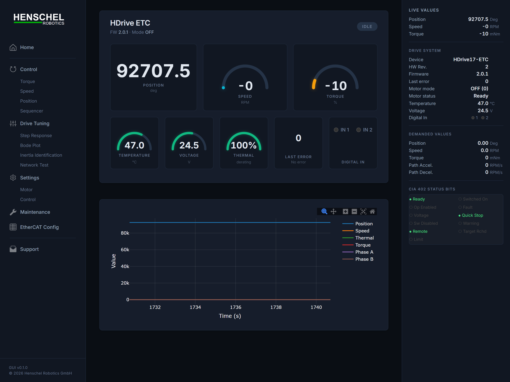
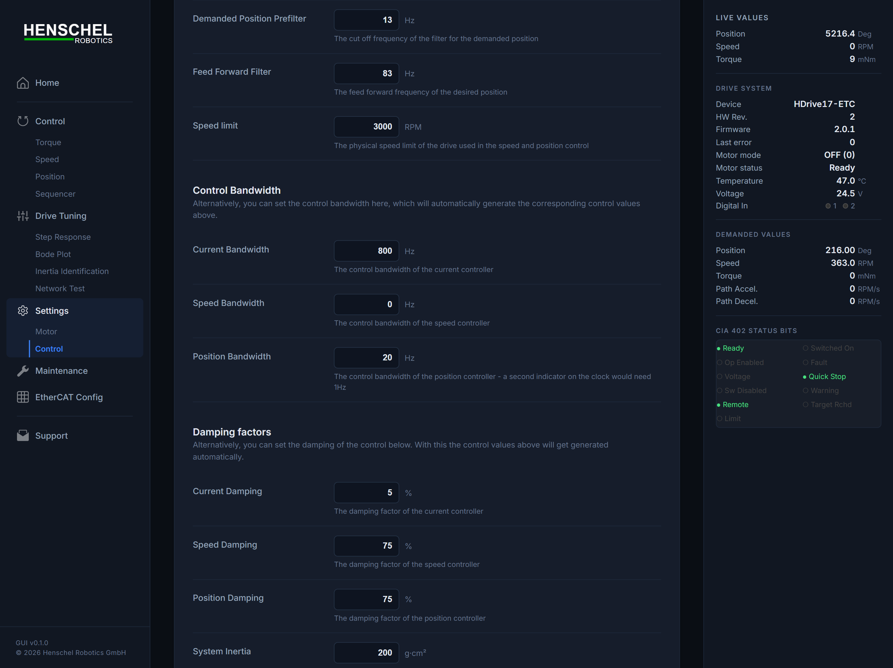
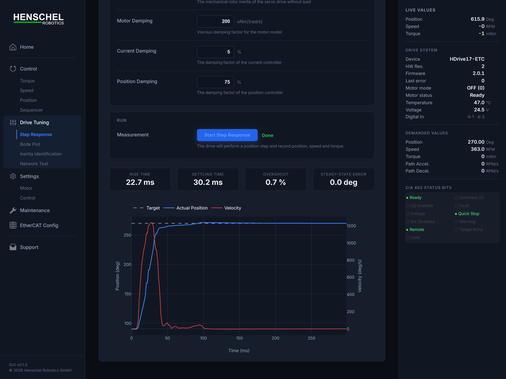
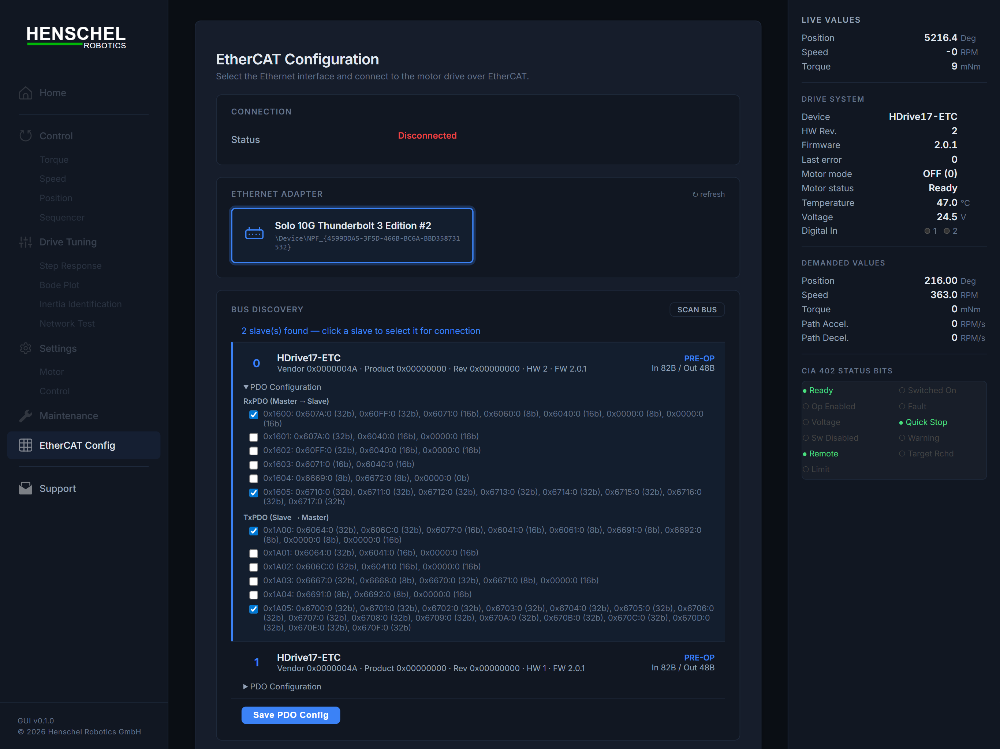

# HDrive EtherCAT Python SDK

Control [Henschel Robotics](https://henschel-robotics.ch) **HDrive** servo motors over **EtherCAT** from Python. No PLC required.



## Web Interface

The SDK includes a full-featured **browser-based GUI** for motor control, monitoring, and testing.

```bash
pip install hdrive-etc
hdrive-web
```

Then open **http://localhost:8081** in your browser.


The web GUI provides:

- **Real-time telemetry** — live position, velocity, torque, temperature, and supply voltage
- **Motor control** — switch modes (torque / velocity / position), set targets, enable / disable
- **Parameter tuning** — adjust control bandwidth, damping, and inertia
- **SDO browser** — read and write any drive object
- **Bus discovery** — scan the EtherCAT bus and configure PDO mapping
- **Built-in tests** — step response, Bode plot (frequency response), inertia identification, and network latency
- **Calibration** — trigger encoder calibration from the browser

| Control | Step Response | EtherCAT Config |
|---|---|---|
|  |  |  |

> **Full guide with all screenshots:** [`docs/web-interface.md`](docs/web-interface.md)

```
hdrive-web --adapter "\Device\NPF_{...}" --slave 0 --port 8081
hdrive-web --list-adapters
```

> **Raspberry Pi / Linux:** The web GUI saves its configuration (adapter, slave, PDO mapping) to `pdo_mapping.json`. When installed via pip, the default file is inside the package directory. Copy it to your working directory for easy editing:
>
> ```bash
> cp $(python3 -c "import hdrive_etc, os; print(os.path.join(os.path.dirname(hdrive_etc.__file__), '..', 'pdo_mapping.json'))") .
> hdrive-web --pdo-config ./pdo_mapping.json
> ```

## Features

- **Simple API** — `motor.set_torque(200)` and you're done
- **Web interface** — built-in browser GUI for control, tuning, and testing
- **Real-time EtherCAT** — 5 ms processdata cycle via PySOEM
- **CiA 402 state machine** — automatic enable/disable transitions
- **Thread-safe** — send commands from any thread
- **Context manager** — automatic connect/disconnect with `with` statement
- **SDO read/write** — read and write drive configuration objects
- **Auto-recovery** — background thread monitors slave health

## Installation

```bash
pip install hdrive-etc
```

Or install from source:

```bash
git clone https://github.com/henschel-robotics/python-hdrive-etc.git
cd python-hdrive-etc
pip install .
```

For development (editable install):

```bash
pip install -e ".[dev]"
```

## Quickstart

```python
from hdrive_etc import HDriveETC, Mode
import time

with HDriveETC(adapter=r"\Device\NPF_{...}") as motor:
    # Wait for motor to be ready
    while motor.get_state_name() != "operation_enabled":
        time.sleep(0.1)

    # Apply torque
    motor.set_mode(Mode.TORQUE)
    motor.set_torque(200)  # 200 mNm

    # Read telemetry
    time.sleep(1)
    print(f"Position: {motor.get_position()}")
    print(f"Velocity: {motor.get_velocity():.1f} RPM")

    motor.stop()

# Motor is automatically stopped and disconnected when leaving the 'with' block
```

## API Reference

### Connect

```python
from hdrive_etc import HDriveETC

# Find your network adapter name
HDriveETC.list_adapters()

# Recommended: use a context manager (auto-connect and auto-disconnect)
with HDriveETC(adapter=r"\Device\NPF_{...}") as motor:
    motor.set_torque(200)

# Motor is stopped and connection is closed automatically.
```

### Torque Control

```python
from hdrive_etc import Mode

# Set torque in milli-Newton-metres
motor.set_mode(Mode.TORQUE)
motor.set_torque(200)   # 200 mNm
```

### Velocity Control

```python
# Set velocity
motor.set_mode(Mode.VELOCITY)
motor.set_velocity(300)
```

### Position Control

```python
# Set target position in encoder increments
motor.set_mode(Mode.POSITION)
motor.set_position(10000)
```

### Stop

```python
# Stop the motor (sets mode to 0)
motor.stop()
```

### Read / Write SDO Objects

```python
# Read a drive object (e.g. modes of operation display)
value = motor.read_sdo(0x6061, 0x00, 'b')
print(f"Current mode: {value}")

# Write a drive object
motor.write_sdo(0x6640, 0x01, 100)  # Set torque bandwidth
```

### Telemetry

```python
# Get motor status snapshot
status = motor.get_status()
print(f"Position: {status['position']}")
print(f"Velocity: {status['velocity']}")
print(f"Torque:   {status['torque']}")

# Individual readings
pos = motor.get_position()        # encoder increments
vel = motor.get_velocity()        # RPM
torque = motor.get_torque()       # actual torque
state = motor.get_state_name()    # CiA 402 state name

# Communication health
stats = motor.get_comm_stats()
print(f"Success rate: {stats['success_rate']:.1f}%")
print(f"Cycle time:   {stats['cycle_time_actual_ms']:.2f} ms")
```

### Error Handling

```python
# Read error code from drive
error_code = motor.get_error_code()
print(motor.get_error_message(error_code))

# Clear error
motor.clear_error()
```

### Control Tuning

```python
# Configure control parameters
motor.configure_control_parameters(
    rotor_inertia=1000,
    damping=500,
    torque_bw=100,
    velocity_bw=200,
    position_bw=300,
)
```

## Control Modes

| Constant              | Value | Description                          |
| --------------------- | ----- | ------------------------------------ |
| `Mode.TORQUE`         | 4     | Cyclic synchronous torque (CST)      |
| `Mode.VELOCITY`       | -3    | Cyclic synchronous velocity / stepper|
| `Mode.POSITION`       | 8     | Cyclic synchronous position (CSP)    |
| `Mode.PROFILE_POSITION` | 1  | Profile position mode                |
| `Mode.PROFILE_VELOCITY` | 3  | Profile velocity mode                |
| `Mode.CALIBRATION`    | -99   | Manufacturer calibration mode        |
| `Mode.STOP`           | 0     | Motor disabled                       |

## CiA 402 States

The motor automatically transitions through these states on connect:

| State                  | Description                     |
| ---------------------- | ------------------------------- |
| `not_ready`            | Drive is initializing           |
| `switch_on_disabled`   | Drive is disabled               |
| `ready_to_switch_on`   | Drive is ready                  |
| `switched_on`          | Drive is powered                |
| `operation_enabled`    | Drive accepts motion commands   |
| `fault`                | Drive is in fault state         |

## Examples

See the [`examples/`](examples/) folder:

- **`basic_control.py`** — Connect, apply torque, print telemetry
- **`velocity_mode.py`** — Constant speed control with direction reversal
- **`torque_mode.py`** — Torque ramp up/down
- **`position_mode.py`** — Move to a sequence of positions
- **`read_sdo.py`** — Read configuration objects via SDO

## Requirements

- Python 3.8+
- [PySOEM](https://github.com/bnjmnp/pysoem) >= 1.1.0
- [Npcap](https://npcap.com/) or WinPcap (Windows only)
  - **Important:** During Npcap installation, check **"Install Npcap in WinPcap API-compatible Mode"**
- EtherCAT-compatible network adapter
- HDrive servo motor with EtherCAT interface
- For USB-to-Ethernet adapters, use one based on the **ASIX AX88772** chipset (recommended for reliable real-time EtherCAT communication) e.g. TU2-ET100

## License

MIT — see [LICENSE](LICENSE) for details.

**Third-party notice:** This package depends on [PySOEM](https://github.com/bnjmnp/pysoem) (MIT),
which wraps [SOEM](https://github.com/OpenEtherCATsociety/SOEM) (GPLv3 / Commercial).
Users are responsible for complying with SOEM's license terms.
For commercial use of SOEM, contact [RT-Labs](https://rt-labs.com) (sales@rt-labs.com).

## Support

- **Email:** info@henschel-robotics.ch
- **Web:** https://henschel-robotics.ch
