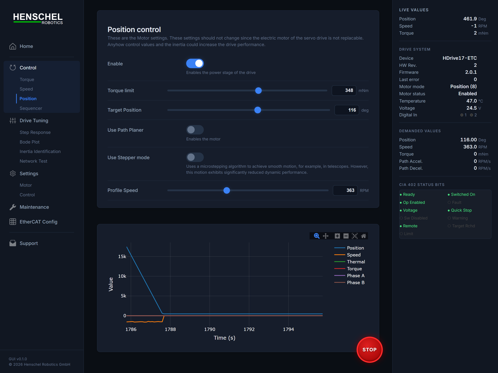
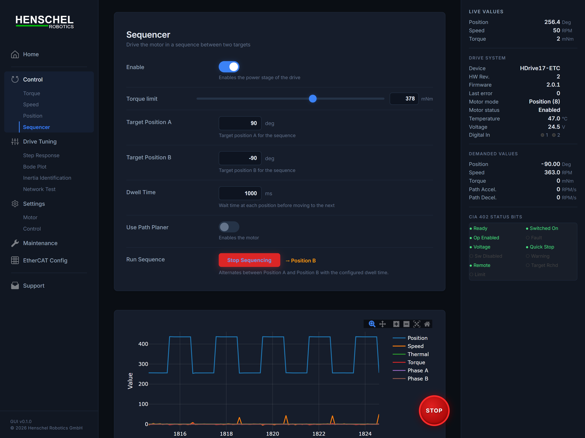
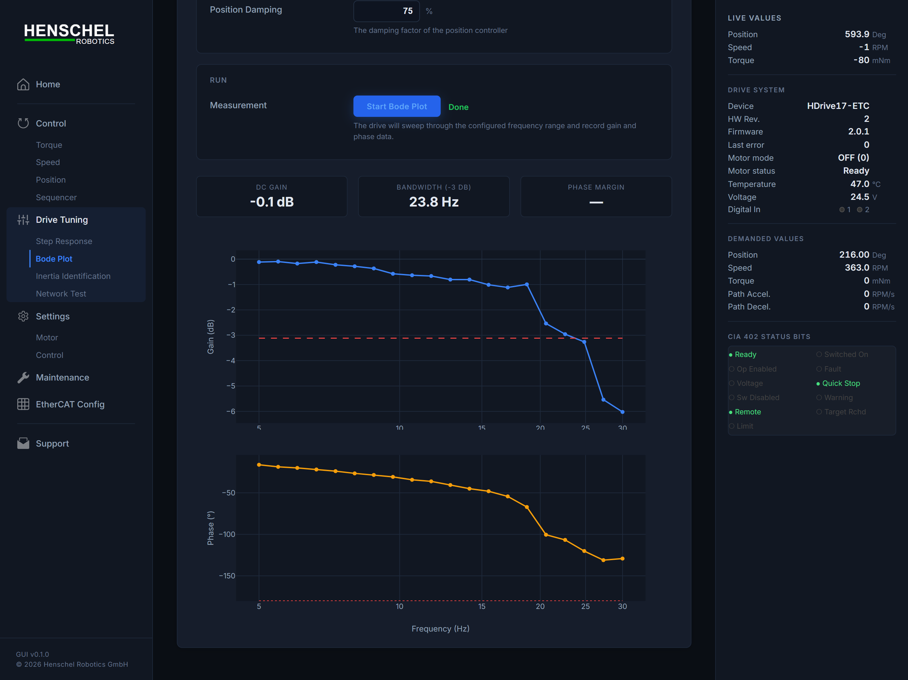
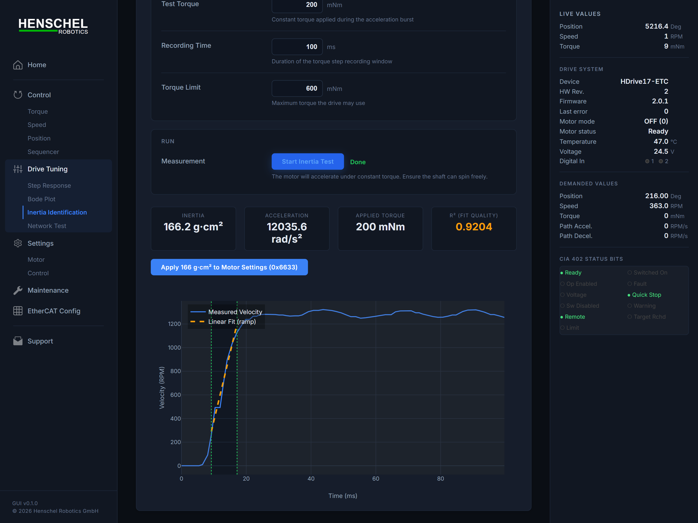
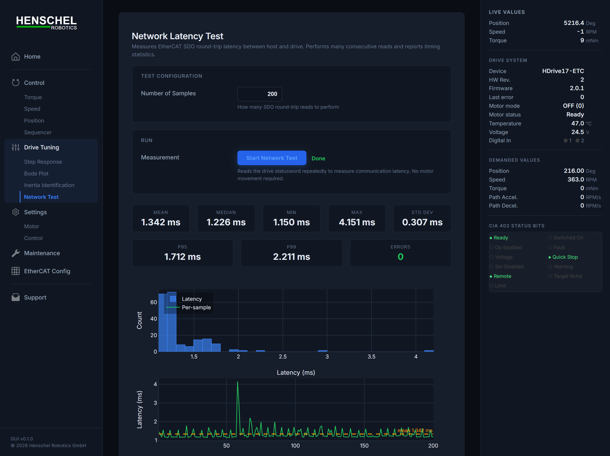
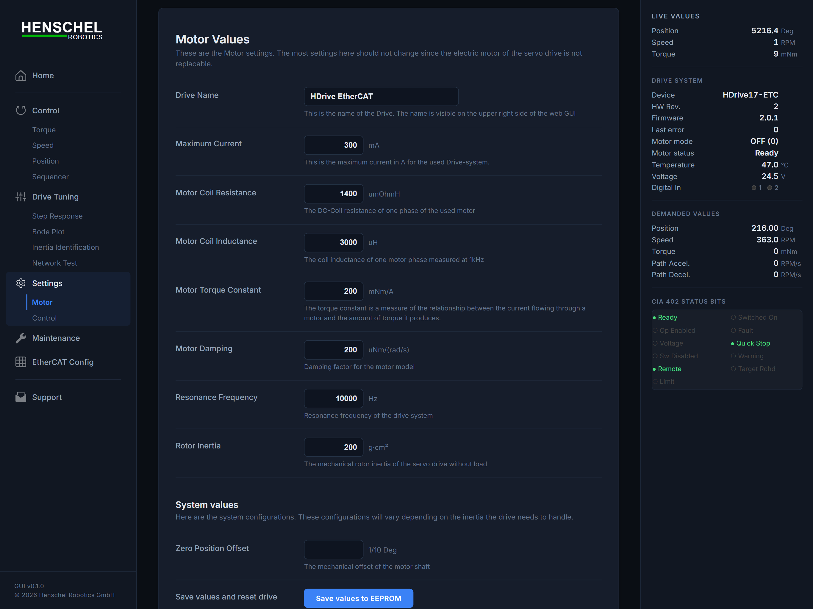
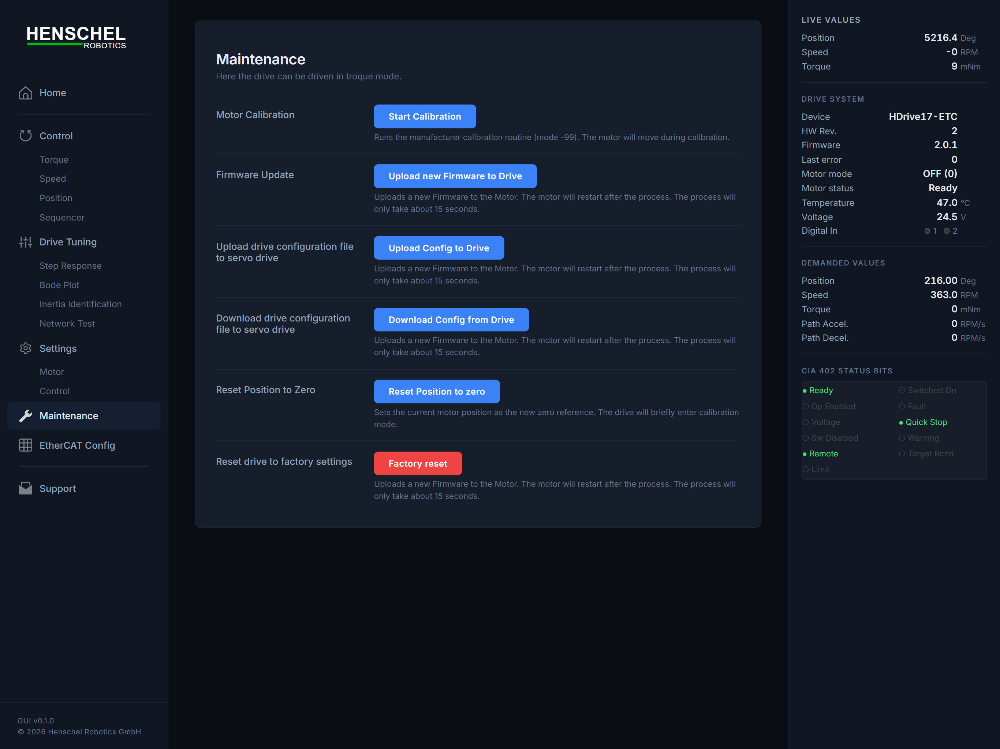

# HDrive ETC — Web Interface Guide

The HDrive ETC web interface provides full motor control, monitoring, tuning, and testing from any browser.

```bash
pip install hdrive-etc
hdrive-web
```

Open **http://localhost:8081** in your browser.

---

## 1. Home — Dashboard


The home screen gives an at-a-glance overview of the motor:

- **Position** — current shaft angle in degrees (numeric display)
- **Speed** — rotor velocity in RPM (gauge arc)
- **Torque** — actual torque as percentage of rated (gauge arc)
- **Temperature** — motor winding temperature in °C
- **Voltage** — DC bus supply voltage in V
- **Thermal Derating** — how much the drive is derated due to temperature
- **Last Error** — current error code with description; click **✕** to clear
- **Digital Inputs** — LED indicators for IN 1 / IN 2

The status badge in the top-right shows **IDLE**, **ACTIVE**, or **ERROR** depending on the motor state.

The live sidebar on the right streams position, velocity, torque, demanded values, and CiA 402 state machine status in real time.

---

## 2. Motor Control


Navigate to **Control → Torque / Speed / Position** to command the motor. Each mode provides:

- A **target input** field (torque in mNm, velocity in RPM, or position in degrees)
- A **live graph** showing commanded vs. actual values over time
- An **Emergency Stop** button that appears when the motor is active

### Position Mode



In position mode you enter a target angle. The graph shows actual position tracking the setpoint.

### Sequencer



The sequencer automates back-and-forth motion between two positions with configurable dwell time — useful for endurance testing and repeatability checks.

---

## 3. Drive Tuning

### Step Response


**Drive Tuning → Step Response** applies a position step and records the transient response. After the test, the GUI displays:

- Rise time, settling time, overshoot, and steady-state error as metric cards
- A plot with target position (dashed), actual position (blue), and velocity (red)

Adjust **bandwidth**, **damping**, and **inertia** before running to iterate on tuning.

### Bode Plot (Frequency Response)



**Drive Tuning → Bode Plot** sweeps sinusoidal torque at increasing frequencies and plots the magnitude and phase response. Use this to measure the mechanical bandwidth and identify resonances.

### Inertia Identification



**Drive Tuning → Inertia Identification** applies controlled torque pulses and calculates the load inertia from the resulting acceleration. The result can be written directly into the drive's inertia parameter.

### Network Latency Test



**Drive Tuning → Network Test** measures the SDO round-trip latency to the slave. Results include min, max, mean, median, P95, P99, and a histogram of the latency distribution. Useful for verifying cable quality and adapter performance.

---

## 4. Settings

### Motor Settings



**Settings → Motor** lets you view and modify drive configuration objects:

- Torque bandwidth, velocity bandwidth, position bandwidth
- Rotor inertia, damping
- Software position limits
- Motor-specific parameters

Click **Apply** to write the values to the drive.

---

## 5. Maintenance



The **Maintenance** page provides:

- **Encoder calibration** — triggers the built-in calibration routine (motor will rotate)
- **Reset position to zero** — zeroes the position counter
- **Firmware version** and drive identity information

---

## 6. EtherCAT Configuration


The **EtherCAT Config** page handles bus setup:

1. **Select adapter** — pick the Ethernet interface connected to the EtherCAT bus
2. **Scan Bus** — detect all slaves; shows device name, vendor, product code, I/O sizes
3. **PDO Configuration** — check/uncheck RxPDO and TxPDO assignments per slave
4. **Save PDO Config** — persists the mapping to `ethercat_config.json`; the system automatically disconnects, re-scans, and reconnects with the new mapping

---

## CLI Options

```
hdrive-web [OPTIONS]

  --adapter ADAPTER     Network adapter name (e.g. "\Device\NPF_{...}")
  --slave INDEX         Slave index (default: 0)
  --cycle MICROSECONDS  PDO cycle time in µs (default: 5000)
  --port PORT           HTTP port (default: 8081)
  --pdo-config PATH     Path to ethercat_config.json
  --list-adapters       List available network adapters and exit
```
